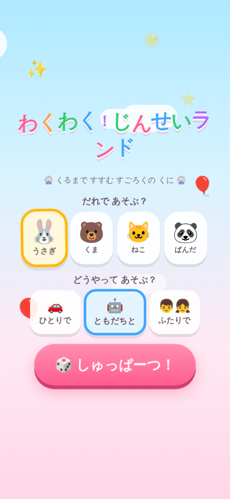
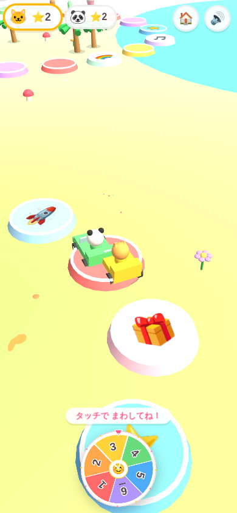
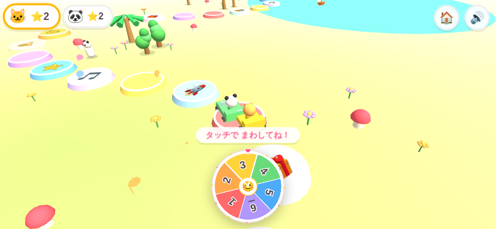
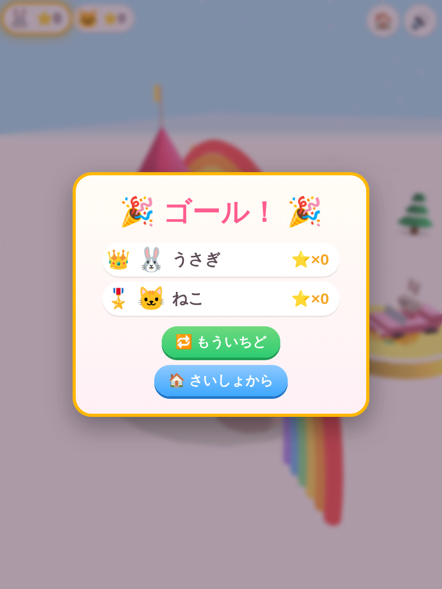

# わくわく！じんせいランド 🎡

人生ゲーム for Nintendo Switch ふうの **3D すごろくゲーム** です。
4歳児が iPhone / iPad で（たて画面でも よこ画面でも）指1本で遊べるように作りました。

| タイトル | ばんめん | よこ画面 | けっか |
|---|---|---|---|
|  |  |  |  |

## あそびかた

1. `index.html` をブラウザで開く（iPhone / iPad の Safari 推奨。「ホーム画面に追加」するとフルスクリーンで遊べます）
2. どうぶつ（🐰うさぎ・🐻くま・🐱ねこ・🐼ぱんだ）をえらぶ
3. あそびかたをえらぶ
   - 🚗 **ひとりで** … のんびりゴールをめざす
   - 🤖 **ともだちと** … コンピュータのどうぶつと交互に遊ぶ
   - 👦👧 **ふたりで** … 1台をふたりで交代しながら遊ぶ
4. 「🎲 しゅっぱーつ！」→ ルーレットをタッチ（またはビュンとはじく）→ くるまがぴょんぴょん進む！

文字が読めなくても遊べるように、すべての指示は **アイコン＋アニメ＋音声（Web Speech）** で伝えます。

## 楽しくなる要素 300% 🎉

### コース（48マス・4つのくに）
- 🌸 **はなばたけ** … 木・お花・きのこ・ちょうちょ
- 🏖 **うみべ** … ヤシの木・海・ゆらゆらヨット
- 🍭 **おかしのくに** … ぺろぺろキャンディ・カップケーキ・キャンディケイン
- ⛄ **ゆきのくに** … 雪だるま・もみの木・氷の結晶・**降る雪**
- ゴールには **にじのかかったお城** ＆ 発着はフラッグガーランドのゲート

### マスのイベント
- ⭐ ほしマス … ほしゲット（キラキラ爆発）
- 🎁 プレゼントマス … 箱がパカッ！中からランダムなおもちゃ（あひる・ロボ・ボール・こぐま）
- 🎂 ケーキマス … **ろうそくをタッチで消すミニゲーム**
- 🌈 にじマス … **空から降るほしをタッチで集めるミニゲーム**
- 🎵 おんがくマス … みんなでダンス、音符がふわふわ
- 🍌 バナナマス … つるりん！2マス後ろへ（コミカルな滑り音つき）
- 🚀 ロケットマス … 炎を吹いて3マスひとっとび

### さわって楽しい
- 地面をタップ → どこでもキラキラ✨＋ポップ音
- くるまをタップ → クラクション🎺＋ジャンプ
- ルーレットは **タップでも、指ではじいても** 回せる（カチカチ音つき）

### にぎやかし
- 道ばたで**おうえんしてくれるどうぶつたち**（通ると跳びはねる）
- 空には流れる雲・気球3機・ぐるぐる飛ぶ小鳥
- 合成BGM（Web Audioで生成、🔊ボタンでオフ）・効果音全部入り・日本語音声読み上げ
- ゴールで**花火大会**＋紙吹雪＋ファンファーレ＋くるくるウィニングラン
- けっか画面はほしのカウントアップ。1位は👑、みんなに🎖️（泣く子が出ない設計）

## フォルダ構成

```
jinsei-land/
├── index.html        画面とUI
├── css/style.css     タイトル・HUD・けっか画面のスタイル
├── js/
│   ├── main.js       画面の切りかえ・キャラ選択
│   ├── game.js       ターン制御・カメラ・マスイベント
│   ├── world.js      コース・4つのくに・かざり
│   ├── characters.js くるま・どうぶつ・おうえんだん
│   ├── roulette.js   ルーレット（Canvas 2D）
│   ├── effects.js    パーティクル・紙吹雪・花火
│   ├── sound.js      効果音・BGM・音声（全部 Web Audio 合成）
│   └── util.js       小道具
├── vendor/three.min.js  Three.js r147（同梱・オフラインOK）
└── assets/           スクリーンショット
```

## 技術メモ

- Three.js（同梱）のみ使用。ビルド不要・完全オフラインで動作
- 音はすべて Web Audio API でリアルタイム合成（音声ファイルなし）
- iOS対応：`viewport-fit=cover`・safe-area・タッチ音声アンロック・ダブルタップ拡大防止
- 縦横どちらでもOK：向きに応じてカメラの高さ・FOV・UIレイアウトを自動調整
- 低負荷設計：ブロブシャドウ（影マップなし）・ジオメトリ使い回し・パーティクルは寿命管理
